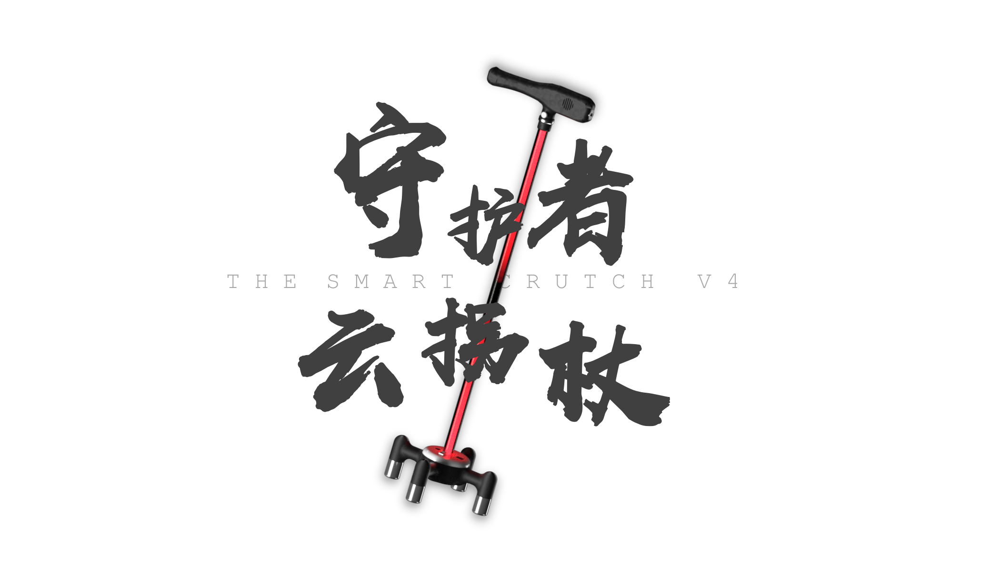

## 守护者云拐杖第4代
**程序组主仓库**

> 本项目开发周期已结束，后续将不再维护。  
> 已添加 MIT License。  
>
> ​	——  [@DeltaZero](https://github.com/233a344a455)  2020.10.17

### 项目简介
**<u>守护者云拐杖</u>** 是一个由 [深圳市第二高级中学创客团队](https://github.com/SZ2G-RoboticsClub) 开发的 **智能拐杖** 项目。  

包括 **开发版(MicroPython)程序、Android APP、服务端** 程序。  

旨在解决老人的出行问题。  

### 功能概述

- 跌倒报警

守护者云拐杖内置云报警的功能，用于第一时间通知家属采取措施进行救援  。  

拐杖控制器内置加速度计与陀螺仪，判定用户是否摔倒后自动报警，并通过Android客户端显示拐杖状态与位置信息。

- 语音导航指引回家

守护者云拐杖内置位系统，激活导航系统后引导用户回家（家庭地址可通过APP进行设置）。  

拐杖使用外置扬声器对导航指令进行实时语音播报，通过云端合成语音指令。

- 行程记录

守护者云拐杖配有前后两个广角摄像头，提起拐杖自动录像。  

可以从APP远程观察用户所在地点与行程路线。  

跌倒发生后，家属可以通过APP查看所在地点实时状况，并将实时上传视频数据至服务端，语音告知潜在施救者若发生法律纠纷可通过服务器调取影像证据。

- 照明灯

按下按键，开启照明。共有三档：常亮，闪烁与关闭。使产品在夜间也能伴老人出行。当光传感器检测到白天时会自动切换彩虹灯模式（仅供家庭娱乐使用，作为彩蛋存在），检测到黑夜时会自动切换为白灯。  

- 无线充电

无线充电模块置于拐杖底座并采用磁吸式设计。只需要将拐杖放在充电座上，“哒”的一声就能充上电，免去老人弯腰找插头插座的麻烦，更避免了因弯腰而导致的其他事故的发生。  

### 项目成员

- [@fengqin-635](https://github.com/fengqin-635) - 指导教师
- [@link857](https://github.com/link857) (DY) - 程序组组长 | [DemoBoard](https://github.com/SZ2G-RoboticsClub/SmartCrutch-DemoBoard) 开发
- [@DeltaZero](https://github.com/233a344a455) - [Android-App](https://github.com/SZ2G-RoboticsClub/SmartCrutch-Android-App) 开发 | [Server](https://github.com/SZ2G-RoboticsClub/SmartCrutch-Server) 开发
- @圆溜溜的小怪兽 (LCL)
- @霜落 (WZY)
- @カネキ (HMY)
- ...

### 项目结构

- [DemoBoard](https://github.com/SZ2G-RoboticsClub/SmartCrutch-DemoBoard) - 开发版(MicroPython)程序
- [Android-App](https://github.com/SZ2G-RoboticsClub/SmartCrutch-Android-App) - 安卓APP程序
- [Server](https://github.com/SZ2G-RoboticsClub/SmartCrutch-Server) - 服务端程序
- Docs - 项目文档文件

### 项目开发规范

请各位成员在非特殊情况下不要对项目直接 commit *(maintainer除外)*  

而是 fork 后 PR，由对应子项目的 maintainer 查看后再合并入仓库   

**请注意不要将数据库文件提交至仓库!!!**  